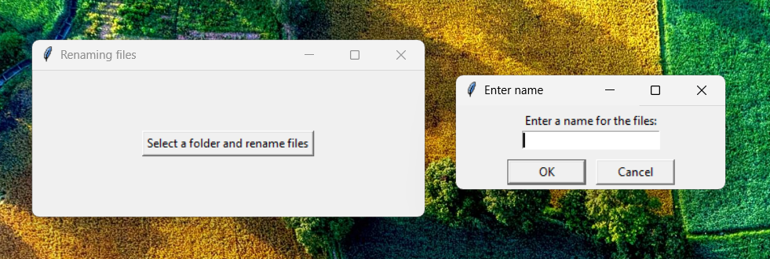

# File Renamer GUI

A simple and user-friendly Python tool for batch renaming files.  
Built with **Tkinter** for a lightweight graphical interface.

---

## 🚀 Features

- Rename multiple files at once  
- Add prefix or suffix to filenames  
- Replace text in filenames  
- Preview changes before renaming  
- Safe renaming (no overwriting existing files)  
- Clean and intuitive GUI

---

## 📦 How to Use

### Run `.exe` (recommended)
Download the latest `.exe` file from the [Releases](https://github.com/martyniuk-andrii/file-renamer-gui/releases/download/v1.0/FileRenamer.exe) section and run it.  
No need to install Python.

---

## 🖼️ Screenshot / Example

Here is an example of the GUI:

